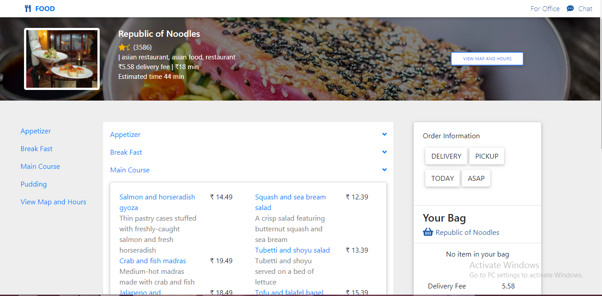

# Delivary.com

> Delivary.com is a clone of delivery.com, an international based food delivery application, that enables users to order from local restaurants and stores for on-demand delivery. 

## Built With

### Client
- React JS
- Redux
- React Hooks
- Font awesome
- Bootstrap
- Material UI

### Server
- Node JS
- Express
- MongoDB
- RazorPay

Feel free to check the API [API Readme](https://github.com/Mamata24/Delivary.com/blob/main/Backend/Readme.md)

#### Project Screenshots

<table>
  <tr>
     <td> Landing Page </td>
  </tr>
  <tr>
    <td>Office Page </td>
  </tr>
  <tr>
  <td>Restaurant Page</td>
  </tr>
  <tr>
  <td>Menu Page</td>
  </tr>
  <tr>
  <td>Checkout Page</td>
  </tr>
  <tr>
  <td>Payment Page</td>
  </tr>
  <tr>
  <td>Order Success Page</td>
  </tr>
  <tr>
  <td>Orders Page</td>
  </tr>
   
 </table>

## Getting Started

**Just fork it and feel free to use it.**

To get a local copy up and running follow these simple example steps.

### Prerequisites

Having a web browser, code editor and git.

### Install

Just fork it and you are good to go.

## Authors

👤 **Akhila Gajulapalli**

- Github: [@AkhilaG28](https://github.com/AkhilaG28)
- Twitter: [@akhila_g28](https://twitter.com/akhila_g28)
- Linkedin: [Akhila G](https://www.linkedin.com/in/akhila-g-a82bb385)
- Email: (akhilagajjulapalli@gmail.com)

  
👤 **Mamata Nayak**

- Github: [@Mamata24](https://github.com/Mamata24)
- Twitter: [@MamataN24](https://twitter.com/MamataN24)
- Linkedin: [Mamata Nayak](https://www.linkedin.com/in/mamata-nayak)
- Email: (nmamta240@gmail.com)

👤 **Siddharth Kumar**

- Github: [@siddharthkumaaar](https://github.com/siddharthkumaaar)
- Twitter: [@@Siddhar41906212](https://twitter.com/@Siddhar41906212)
- Linkedin: [Siddharth Kumar](https://www.linkedin.com/in/siddharth-kumaaar)
- Email: (siddharthkumaaar@gmail.com)

## 🤝 Contributing

Contributions, issues and feature requests are welcome!

Feel free to check the [issues page](https://github.com/Mamata24/Delivary.com/issues).

## Show your support

Give a ⭐️ if you like this project!

## Acknowledgments

- We take all the responsiblity for every signle line of code. The design is inspired from Delivery.com.

